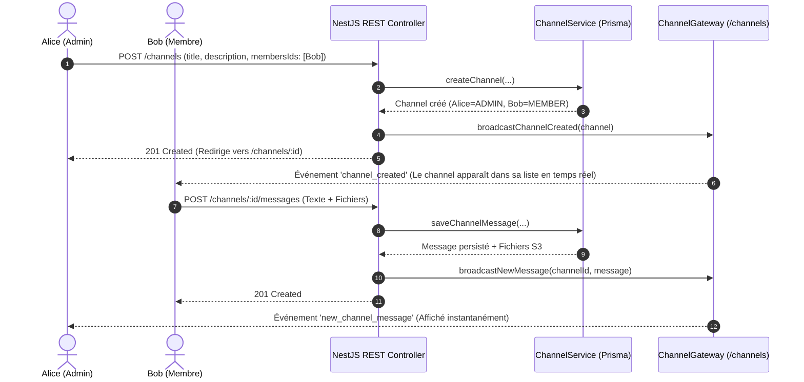

# 🚀 Spécification & Guide d'Implémentation : Channels & Discussions de Groupe

> **Projet** : ft_transcendence (42 School)  
> **Conformité** : Sujet v21.2 (*Surprise*) — Modules *User Interaction*, *Real-time features*, *Advanced Permissions*, *File Upload*.  
> **Modèle de Rôles** : `ADMIN` et `MEMBER` uniquement (Robuste, sans sur-ingénierie).  
> **Architecture Hybride** : Requêtes et actions via **REST API** + Synchronisation instantanée via **WebSockets (Socket.IO namespace `/channels`)**.

---

## 📑 Table des Matières
1. [Architecture Globale & Pattern Hybride REST / WebSocket](#1-architecture-globale--pattern-hybride-rest--websocket)
2. [Modélisation & Schéma Prisma](#2-modélisation--schéma-prisma)
3. [Règles Métier & Matrice des Rôles](#3-règles-métier--matrice-des-rôles)
4. [Backend NestJS : Implémentation Complète](#4-backend-nestjs--implémentation-complète)
   - [DTOs de Validation (`srcs/backend/src/channel/dto/`)](#a-dtos-de-validation)
   - [Service Métier (`ChannelService`)](#b-service-métier-channelservice)
   - [Passerelle WebSocket (`ChannelGateway` - namespace `/channels`)](#c-passerelle-websocket-channelgateway)
   - [Contrôleur REST (`ChannelController`)](#d-contrôleur-rest-channelcontroller)
   - [Module NestJS (`ChannelModule`)](#e-module-nestjs-channelmodule)
5. [Frontend Next.js : Architecture Modulaire & Composants](#5-frontend-nextjs--architecture-modulaire--composants)
   - [Structure Modulaire des Fichiers](#a-structure-modulaire-des-fichiers)
   - [Types TypeScript Dédiés](#b-types-typescript-dédiés)
   - [Service Client REST (`channel-service.ts`)](#c-service-client-rest-channel-servicets)
   - [Hook / Utilitaire Socket.IO (`/channels`)](#d-hook--utilitaire-socketio-channels)
   - [Navigation Dédiée (Onglet Canaux Distinct de Chat)](#e-navigation-dédiée-onglet-canaux-distinct-de-chat)
   - [Composant Liste des Canaux (`ChannelListClient.tsx`)](#f-composant-liste-des-canaux-channellistclienttsx)
   - [Modale de Création avec Sélection Multi-Utilisateurs (`CreateChannelModal.tsx`)](#g-modale-de-création-avec-sélection-multi-utilisateurs-createchannelmodaltsx)
   - [Page de Discussion & Composants Découplés](#h-page-de-discussion--composants-découplés)
     - [Composant Principal (`ChannelConversationClient.tsx`)](#1-composant-principal-channelconversationclienttsx)
     - [En-Tête (`ChannelHeader.tsx`)](#2-en-tête-channelheadertsx)
     - [Flux de Messages (`ChannelMessages.tsx`)](#3-flux-de-messages-channelmessagestsx)
     - [Zone de Saisie & Fichiers (`ChannelInput.tsx`)](#4-zone-de-saisie--fichiers-channelinputtsx)
     - [Modale de Gestion des Membres & Rôles (`ChannelMembersModal.tsx`)](#5-modale-de-gestion-des-membres--rôles-channelmembersmodaltsx)
6. [Scénarios de Test pour la Soutenance 42](#6-scénarios-de-test-pour-la-soutenance-42)

---

## 1. Architecture Globale & Pattern Hybride REST / WebSocket

Le système de Channels applique une séparation stricte des responsabilités calquée sur le module de messagerie directe :
1. **Toutes les actions utilisateur passent par des endpoints HTTP REST** :
   - `GET /channels/available-users` : Liste des utilisateurs éligibles pour un groupe (en excluant strictement l'utilisateur connecté et toutes les relations `BLOCKED`).
   - `GET /channels/my` : Récupération de tous les canaux dont l'utilisateur est membre.
   - `POST /channels` : Création du groupe avec ajout immédiat des membres sélectionnés.
   - `GET /channels/:id` : Récupération des informations et des membres d'un canal.
   - `POST /channels/:id/messages` : Envoi de message avec pièces jointes (fichiers/images téléversés sur S3 / LocalStack).
   - `POST /channels/:id/members` : Ajout d'un membre (`ADMIN` requis).
   - `DELETE /channels/:id/members/:targetUserId` : Expulsion d'un membre (`ADMIN` requis).
   - `PATCH /channels/:id/members/:targetUserId/role` : Modification du rôle (`ADMIN` requis).
   - `POST /channels/:id/leave` : Départ volontaire du groupe.
   - `DELETE /channels/:id` : Suppression intégrale du canal (`ADMIN` requis).
2. **WebSocket (Socket.IO)** gère la réactivité instantanée de l'interface et les notifications :
   - Namespace dédié : **`/channels`**.
   - Authentification via session cookie à la connexion (`auth.api.getSession`).
   - Rejoindre la room de discussion : événement `join_channel` -> `client.join("channel:" + channelId)`.
   - Quitter la room : événement `leave_channel` -> `client.leave("channel:" + channelId)`.
   - Événements diffusés :
     - `channel_created` : envoyé aux rooms `user:${userId}` des membres invités pour faire apparaître le canal dans leur liste en direct.
     - `new_channel_message` : diffusé dans `channel:${channelId}`.
     - `channel_member_joined` : diffusé dans `channel:${channelId}` + notification `channel_added_you` à `user:${userId}`.
     - `channel_member_left` : diffusé dans `channel:${channelId}` + notification `channel_removed_you` à `user:${userId}`.
     - `channel_role_updated` : diffusé dans `channel:${channelId}`.
     - `channel_deleted` : diffusé dans `channel:${channelId}`.



---

## 2. Modélisation & Schéma Prisma

Fichier : [`srcs/backend/prisma/schema.prisma`](file:///home/micael-jerry/MyFolder/42/ft_transcendence/srcs/backend/prisma/schema.prisma#L258-L308)

```prisma
enum ChannelRole {
  ADMIN
  MEMBER
}

model Channel {
  id          String   @id @default(cuid(2))
  createdById String
  title       String
  description String
  mediaUrl    String?
  createdAt   DateTime @default(now())
  updatedat   DateTime @updatedAt

  createdBy   User                 @relation("ChannelCreator", fields: [createdById], references: [id], onDelete: Cascade)
  members     UserInChannel[]
  messages    UserChannelMessage[]

  @@index([createdById])
  @@map("channels")
}

model UserInChannel {
  userId    String
  channelId String
  role      ChannelRole @default(MEMBER)
  joinedAt  DateTime    @default(now())

  user    User    @relation(fields: [userId], references: [id], onDelete: Cascade)
  channel Channel @relation(fields: [channelId], references: [id], onDelete: Cascade)

  @@id([userId, channelId])
  @@map("user_in_channels")
}

model UserChannelMessage {
  id        String   @id @default(cuid(2))
  userId    String
  channelId String
  content   String
  mediaUrls String[] @default([])
  createdAt DateTime @default(now())
  updatedat DateTime @updatedAt

  user    User    @relation(fields: [userId], references: [id], onDelete: Cascade)
  channel Channel @relation(fields: [channelId], references: [id], onDelete: Cascade)

  @@index([channelId, createdAt(sort: Asc)])
  @@map("user_channel_messages")
}
```

---

## 3. Règles Métier & Matrice des Rôles

| Action | `ADMIN` | `MEMBER` | Règle Métier & Garde-Fous |
| :--- | :---: | :---: | :--- |
| **Lire & envoyer des messages / fichiers** | ✅ | ✅ | Être membre actif du canal |
| **Ajouter un utilisateur** | ✅ | ❌ | L'utilisateur ciblé ne doit pas déjà être membre |
| **Expulser un membre (`kickMember`)** | ✅ | ❌ | Impossible de s'expulser soi-même (utiliser `leave`) |
| **Promouvoir un membre en `ADMIN`** | ✅ | ❌ | Devient un administrateur à part entière |
| **Rétrograder un `ADMIN` en `MEMBER`** | ✅ | ❌ | **Refusé s'il s'agit du dernier administrateur** |
| **Quitter le groupe (`leaveChannel`)** | ⚠️ | ✅ | **`MEMBER` : libre immédiatement.**<br/>**`ADMIN` : refusé s'il est le dernier admin.** Un message d'erreur `400 Bad Request` exige la promotion d'un successeur ou la suppression du groupe. |
| **Supprimer directement le groupe** | ✅ | ❌ | Suppression intégrale en cascade (`onDelete: Cascade`) |

---

## 4. Backend NestJS : Implémentation Complète

### A. DTOs de Validation

#### 1. `srcs/backend/src/channel/dto/create-channel.dto.ts`
```typescript
import { ApiProperty, ApiPropertyOptional } from "@nestjs/swagger";
import { IsArray, IsNotEmpty, IsOptional, IsString, MaxLength } from "class-validator";

export class CreateChannelDto {
	@ApiProperty({ description: 'The title of the channel' })
	@IsString()
	@IsNotEmpty()
	@MaxLength(100)
	title: string;

	@ApiProperty({ description: 'The description of the channel' })
	@IsString()
	@MaxLength(200)
	description: string;

	@ApiPropertyOptional({ description: 'The IDs of the members to add to the channel' })
	@IsOptional()
	@IsArray()
	@IsString({ each: true })
	membersIds?: string[];
}
```

#### 2. `srcs/backend/src/channel/dto/add-member.dto.ts`
```typescript
import { ApiProperty } from "@nestjs/swagger";
import { IsNotEmpty, IsString } from "class-validator";

export class AddMemberDto {
	@ApiProperty({ description: 'The ID of the member to add to the channel' })
	@IsString()
	@IsNotEmpty()
	memberId: string;
}
```

#### 3. `srcs/backend/src/channel/dto/update-role.dto.ts`
```typescript
import { IsEnum, IsNotEmpty } from 'class-validator';
import { ApiProperty } from '@nestjs/swagger';

export enum ChannelRoleEnum {
  ADMIN = 'ADMIN',
  MEMBER = 'MEMBER',
}

export class UpdateRoleDto {
  @ApiProperty({ enum: ChannelRoleEnum, description: 'The role to update the user to' })
  @IsEnum(ChannelRoleEnum)
  @IsNotEmpty()
  role: ChannelRoleEnum;
}
```

#### 4. `srcs/backend/src/channel/dto/send-message-channel.dto.ts`
```typescript
import { IsOptional, IsString, MaxLength } from 'class-validator';
import { ApiPropertyOptional } from '@nestjs/swagger';

export class SendChannelMessageDto {
  @ApiPropertyOptional({ description: 'The content of the message to send (can be empty if only sending attachments)' })
  @IsOptional()
  @IsString()
  @MaxLength(2000)
  content?: string;
}
```

---

### B. Service Métier (`ChannelService`)

Fichier : [`srcs/backend/src/channel/channel.service.ts`](file:///home/micael-jerry/MyFolder/42/ft_transcendence/srcs/backend/src/channel/channel.service.ts)

Contient la logique de récupération filtrée des utilisateurs disponibles (hors bloqués), la gestion des permissions admin, le départ sécurisé du dernier admin, et la persistance des messages et pièces jointes S3.

---

### C. Passerelle WebSocket (`ChannelGateway`)

Fichier : [`srcs/backend/src/channel/channel.gateway.ts`](file:///home/micael-jerry/MyFolder/42/ft_transcendence/srcs/backend/src/channel/channel.gateway.ts)

Gère les connexions authentifiées au namespace `/channels`, l'adhésion aux rooms `channel:${channelId}` via `join_channel` / `leave_channel`, et l'ensemble des broadcasts d'événements.

---

### D. Contrôleur REST (`ChannelController`)

Fichier : [`srcs/backend/src/channel/channel.controller.ts`](file:///home/micael-jerry/MyFolder/42/ft_transcendence/srcs/backend/src/channel/channel.controller.ts)

Expose les 10 routes REST avec `AuthGuard`, validation des données et déclenchement automatique des notifications Socket.IO.

---

### E. Module NestJS (`ChannelModule`)

Fichier : [`srcs/backend/src/channel/channel.module.ts`](file:///home/micael-jerry/MyFolder/42/ft_transcendence/srcs/backend/src/channel/channel.module.ts)

Enregistre `ChannelService` et `ChannelGateway` dans les providers et les exports.

---

## 5. Frontend Next.js : Architecture Modulaire & Composants

### A. Structure Modulaire des Fichiers

Afin de respecter le principe de **responsabilité unique (SRP)** et la lisibilité du code, le module frontend est découpé comme suit :

```
srcs/frontend/app/[locale]/(private)/channels/
├── page.tsx                             // Page serveur racine (/channels)
├── ChannelListClient.tsx                 // Liste interactive des canaux & écoute socket
├── _services/
│   └── channel-service.ts               // Appels API REST centralisés
├── _components/
│   ├── CreateChannelModal.tsx           // Modale de création avec multi-sélection
│   └── channel-list.types.ts            // Types partagés pour la liste
└── [id]/
    ├── page.tsx                         // Page serveur dynamique (/channels/[id])
    ├── ChannelConversationClient.tsx     // Orchestrateur de la discussion & Socket.IO
    └── _components/
        ├── ChannelHeader.tsx            // En-tête (titre, membres, bouton paramètres)
        ├── ChannelMessages.tsx          // Flux des messages avec nom & avatar expéditeur
        ├── ChannelInput.tsx             // Saisie texte & aperçu pièces jointes
        ├── ChannelMembersModal.tsx      // Gestion des membres, rôles & actions
        └── channel.types.ts             // Types de données de la conversation
```

---

### B. Types TypeScript Dédiés

#### `srcs/frontend/app/[locale]/(private)/channels/_components/channel-list.types.ts`
```typescript
export interface AvailableUser {
  id: string;
  name: string | null;
  image: string | null;
  email: string;
}

export interface ChannelListItem {
  id: string;
  title: string;
  description: string;
  mediaUrl: string | null;
  createdById: string;
  createdAt: string;
  updatedat: string;
  _count: { messages: number };
  members: { role: 'ADMIN' | 'MEMBER'; joinedAt: string }[];
}
```

#### `srcs/frontend/app/[locale]/(private)/channels/[id]/_components/channel.types.ts`
```typescript
export interface ChannelParticipant {
  id: string;
  name: string | null;
  image: string | null;
  email: string;
}

export interface ChannelMemberItem {
  userId: string;
  channelId: string;
  role: 'ADMIN' | 'MEMBER';
  joinedAt: string;
  user: ChannelParticipant;
}

export interface ChannelDetail {
  id: string;
  title: string;
  description: string;
  mediaUrl: string | null;
  createdById: string;
  createdAt: string;
  updatedat: string;
  members: ChannelMemberItem[];
}

export interface ChannelMessage {
  id: string;
  userId: string;
  channelId: string;
  content: string;
  mediaUrls: string[];
  createdAt: string;
  updatedat: string;
  user: ChannelParticipant;
}

export interface SelectedFile {
  id: string;
  file: File;
  previewUrl: string;
  isImage: boolean;
}
```

---

### C. Service Client REST (`channel-service.ts`)

Fichier : `srcs/frontend/app/[locale]/(private)/channels/_services/channel-service.ts`

```typescript
import type { AvailableUser, ChannelListItem } from "../_components/channel-list.types";
import type { ChannelDetail, ChannelMessage } from "../[id]/_components/channel.types";

export async function fetchAvailableUsers(): Promise<AvailableUser[]> {
  const res = await fetch("/nest/channels/available-users", { credentials: "include" });
  if (!res.ok) throw new Error("Impossible de charger les utilisateurs disponibles.");
  return res.json();
}

export async function fetchMyChannels(): Promise<ChannelListItem[]> {
  const res = await fetch("/nest/channels/my", { credentials: "include" });
  if (!res.ok) throw new Error("Impossible de charger vos canaux.");
  return res.json();
}

export async function createChannel(data: {
  title: string;
  description: string;
  membersIds?: string[];
}): Promise<ChannelDetail> {
  const res = await fetch("/nest/channels", {
    method: "POST",
    headers: { "Content-Type": "application/json" },
    credentials: "include",
    body: JSON.stringify(data),
  });
  if (!res.ok) {
    const err = await res.json().catch(() => ({}));
    throw new Error(err.message || "Échec de la création du channel.");
  }
  return res.json();
}

export async function fetchChannelDetails(channelId: string): Promise<ChannelDetail> {
  const res = await fetch(`/nest/channels/${channelId}`, { credentials: "include" });
  if (!res.ok) throw new Error("Impossible de charger les détails du canal.");
  return res.json();
}

export async function fetchChannelMessages(channelId: string): Promise<ChannelMessage[]> {
  const res = await fetch(`/nest/channels/${channelId}/messages`, { credentials: "include" });
  if (!res.ok) throw new Error("Impossible de charger les messages.");
  return res.json();
}

export async function sendChannelMessage(
  channelId: string,
  content: string,
  files: File[],
): Promise<ChannelMessage> {
  const formData = new FormData();
  if (content.trim()) formData.append("content", content.trim());
  files.forEach((file) => formData.append("files", file));

  const res = await fetch(`/nest/channels/${channelId}/messages`, {
    method: "POST",
    credentials: "include",
    body: formData,
  });
  if (!res.ok) {
    const err = await res.json().catch(() => ({}));
    throw new Error(err.message || "Erreur lors de l'envoi du message.");
  }
  return res.json();
}

export async function addMemberToChannel(channelId: string, memberId: string): Promise<void> {
  const res = await fetch(`/nest/channels/${channelId}/members`, {
    method: "POST",
    headers: { "Content-Type": "application/json" },
    credentials: "include",
    body: JSON.stringify({ memberId }),
  });
  if (!res.ok) {
    const err = await res.json().catch(() => ({}));
    throw new Error(err.message || "Impossible d'ajouter ce membre.");
  }
}

export async function kickMemberFromChannel(channelId: string, targetUserId: string): Promise<void> {
  const res = await fetch(`/nest/channels/${channelId}/members/${targetUserId}`, {
    method: "DELETE",
    credentials: "include",
  });
  if (!res.ok) throw new Error("Impossible d'expulser ce membre.");
}

export async function updateMemberRole(
  channelId: string,
  targetUserId: string,
  role: "ADMIN" | "MEMBER",
): Promise<void> {
  const res = await fetch(`/nest/channels/${channelId}/members/${targetUserId}/role`, {
    method: "PATCH",
    headers: { "Content-Type": "application/json" },
    credentials: "include",
    body: JSON.stringify({ role }),
  });
  if (!res.ok) {
    const err = await res.json().catch(() => ({}));
    throw new Error(err.message || "Impossible de modifier le rôle.");
  }
}

export async function leaveChannel(channelId: string): Promise<void> {
  const res = await fetch(`/nest/channels/${channelId}/leave`, {
    method: "POST",
    credentials: "include",
  });
  if (!res.ok) {
    const err = await res.json().catch(() => ({}));
    throw new Error(err.message || "Impossible de quitter le groupe.");
  }
}

export async function deleteChannel(channelId: string): Promise<void> {
  const res = await fetch(`/nest/channels/${channelId}`, {
    method: "DELETE",
    credentials: "include",
  });
  if (!res.ok) throw new Error("Impossible de supprimer le canal.");
}
```

---

### D. Store Zustand & Hooks Socket.IO Dédiés

#### 1. Store Zustand (`srcs/frontend/stores/use-channel-store.ts`)
Calqué sur `use-chat-store.ts`, il gère l'état global des canaux, les messages actifs, le canal sélectionné et le compteur de messages non lus (`unreadCount`) :

```typescript
export interface ChannelState {
  channels: ChannelListItem[];
  activeChannelId: string | null;
  activeChannel: ChannelDetail | null;
  activeMessages: ChannelMessage[];
  isConnected: boolean;

  setConnected: (connected: boolean) => void;
  setChannels: (channels: ChannelListItem[]) => void;
  setActiveChannelId: (id: string | null) => void;
  setActiveChannel: (channel: ChannelDetail | null) => void;
  setActiveMessages: (messages: ChannelMessage[]) => void;
  addActiveMessage: (message: ChannelMessage) => void;

  handleNewMessage: (message: ChannelMessage, currentUserId: string) => void;
  handleChannelCreated: (channel: ChannelDetail | ChannelListItem) => void;
  handleMemberJoined: (channelId: string, member: ChannelMemberItem) => void;
  handleMemberLeft: (channelId: string, userId: string, currentUserId: string) => void;
  handleRoleUpdated: (channelId: string, userId: string, role: "ADMIN" | "MEMBER") => void;
  handleChannelDeleted: (channelId: string) => void;

  getTotalUnreadCount: () => number;
  reset: () => void;
}
```

#### 2. Hooks Socket.IO (`srcs/frontend/hooks/use-channel-socket.ts`)
- `useChannelSocketInit()` : Monté dans `(private)/layout.tsx` aux côtés de `useChatSocketInit()`. Il écoute le namespace `/channels` en tâche de fond et alimente `useChannelStore`.
- `useChannelRoomSocket(channelId)` : Gère les événements `join_channel` / `leave_channel` pour le canal actif.

---

### E. Navigation Dédiée avec Bulle de Notification (Badge)

Dans [`srcs/frontend/components/Nav/NavTabs.tsx`](file:///home/micael-jerry/MyFolder/42/ft_transcendence/srcs/frontend/components/Nav/NavTabs.tsx) et [`MobileBottomNav.tsx`](file:///home/micael-jerry/MyFolder/42/ft_transcendence/srcs/frontend/components/Nav/MobileBottomNav.tsx) :

```typescript
import { Home, Users, MessageSquare, Hash } from "@/components/icons";
import { useChatStore } from "@/stores/use-chat-store";
import { useChannelStore } from "@/stores/use-channel-store";

export function NavTabs() {
  const totalChatUnread = useChatStore((state) => state.getTotalUnreadCount());
  const totalChannelUnread = useChannelStore((state) => state.getTotalUnreadCount());

  // Rendu de l'icône avec bulle de notification
  // {tab.href === "/channels" && totalChannelUnread > 0 && (
  //   <span className="badge">{totalChannelUnread > 99 ? "99+" : totalChannelUnread}</span>
  // )}
}
```

---

### F. Composant Liste des Canaux (`ChannelListClient.tsx`)

Fichier : `srcs/frontend/app/[locale]/(private)/channels/ChannelListClient.tsx`

- Affiche la liste des canaux avec le nombre de membres et le rôle de l'utilisateur (`ADMIN` ou `MEMBER`).
- Possède le bouton **"Créer un canal"** qui ouvre `CreateChannelModal`.
- Écoute les événements WebSocket `channel_created`, `channel_added_you`, `channel_removed_you`, et `channel_deleted` pour actualiser la liste instantanément en temps réel.

---

### G. Modale de Création avec Sélection Multi-Utilisateurs (`CreateChannelModal.tsx`)

Fichier : `srcs/frontend/app/[locale]/(private)/channels/_components/CreateChannelModal.tsx`

- Formulaire : Titre (max 100 char), Description (max 200 char).
- Récupère la liste des utilisateurs éligibles via `GET /channels/available-users`.
- Filtre interactif de recherche par nom et email.
- Sélecteur multi-utilisateurs avec case à cocher et badge de comptage.
- À la validation, envoie `POST /channels` avec `{ title, description, membersIds }` et redirige directement vers `/channels/${channel.id}`.

---

### H. Page de Discussion & Composants Découplés

#### 1. Composant Principal (`ChannelConversationClient.tsx`)
- Orchestre l'état : détails du canal, messages, statut d'envoi.
- Connexion à la room du canal via Socket.IO :
  ```typescript
  socket.emit("join_channel", { channelId });
  ```
- Réception en direct de `new_channel_message`, `channel_member_left`, `channel_member_joined`, `channel_role_updated`, `channel_deleted`.

#### 2. En-Tête (`ChannelHeader.tsx`)
- Affiche le nom du canal, le nombre de membres, et le bouton ouvrant la modale de modération/membres.
- Bouton retour vers `/channels`.

#### 3. Flux de Messages (`ChannelMessages.tsx`)
- Affiche pour chaque message reçu l'avatar et le nom de l'expéditeur.
- Rendu des pièces jointes (images, vidéos, fichiers) via `ChatMessageMedia`.
- Défilement automatique vers le bas à chaque nouveau message.

#### 4. Zone de Saisie & Fichiers (`ChannelInput.tsx`)
- Champ texte avec envoi sur touche Entrée.
- Bouton trombone pour joindre plusieurs fichiers (images, documents).
- Puces d'aperçu des fichiers avant envoi avec bouton de suppression.
- Bouton d'envoi avec icône de chargement pendant l'upload.

#### 5. Modale de Gestion des Membres & Rôles (`ChannelMembersModal.tsx`)
- Liste tous les membres avec badges `ADMIN` et `MEMBER`.
- Permet aux administrateurs de promouvoir d'autres membres en `ADMIN`, de rétrograder un admin, ou d'expulser un membre.
- Bouton **"Quitter le groupe"** pour tout membre (avec blocage explicite si dernier admin).
- Bouton **"Supprimer le groupe"** pour les administrateurs.

---

## 6. Scénarios de Test pour la Soutenance 42

1. **Création & Exclusion des Utilisateurs Bloqués** :
   - Bloquer un utilisateur de test depuis la section Amis.
   - Ouvrir la modale *Créer un canal* : constater que l'utilisateur bloqué est absent de la liste.
   - Sélectionner deux autres utilisateurs et créer le groupe : le créateur devient `ADMIN` et les invités deviennent `MEMBER`.
2. **Diffusion Temps Réel** :
   - Sur l'écran des invités, le nouveau canal apparaît immédiatement sans recharger la page.
3. **Échange de Messages & Médias S3** :
   - Envoyer un message avec image/fichier joint : diffusion instantanée à tous les participants connectés.
4. **Garde-fou du Dernier Administrateur** :
   - L'admin unique tente de quitter le groupe : une alerte claire indique qu'il doit d'abord promouvoir un autre admin ou supprimer le groupe.
5. **Suppression Directe** :
   - L'admin clique sur *Supprimer le canal* : le canal est détruit et tous les clients connectés sont redirigés instantanément vers `/channels`.
