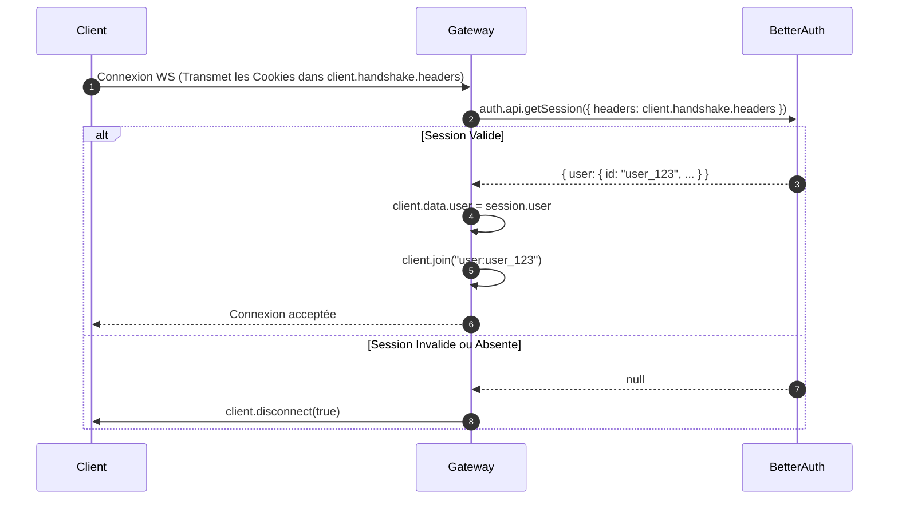

# 📘 Guide d'Apprentissage & d'Implémentation Backend : Système de Messagerie Temps Réel

Ce guide a été conçu pour t'apprendre en profondeur le fonctionnement d'un système de messagerie temps réel moderne, tout en te guidant pas à pas dans l'écriture du code backend pour `ft_transcendence` avec **NestJS**, **Socket.io**, **Prisma (PostgreSQL)** et **Better Auth**.

> 💡 **Mise à jour d'Architecture** : Conformément aux meilleures pratiques de conception logicielle (*Single Responsibility Principle*), la gestion de la **Présence** (statut en ligne/hors-ligne global) a été séparée du **Chat** dans un module dédié `PresenceModule` (`/presence`). Ce guide détaille cette architecture découplée et explique comment `ChatModule` (`/chat`) se concentre exclusivement sur les échanges de messages.

---

## 📑 Table des Matières
1. [Concepts Fondamentaux & Modèles Mentaux](#1-concepts-fondamentaux--modèles-mentaux)
   - [HTTP Classique vs WebSockets](#http-classique-vs-websockets)
   - [Pourquoi Socket.io au-dessus des WebSockets purs ?](#pourquoi-socketio-au-dessus-des-websockets-purs-)
   - [Le Multiplexage Socket.io : Séparer `/presence` et `/chat` sans surcoût](#le-multiplexage-socketio--séparer-presence-et-chat-sans-surcoût)
   - [Comment NestJS structure les WebSockets (Gateway, Rooms, Namespaces)](#comment-nestjs-structure-les-websockets)
2. [L'Authentification WebSocket avec Better Auth](#2-lauthentification-websocket-avec-better-auth)
   - [Le cycle de vie du Handshake](#le-cycle-de-vie-du-handshake)
   - [Sécuriser la connexion avant d'échanger le moindre octet](#sécuriser-la-connexion-avant-déchanger-le-moindre-octet)
3. [Le Module Dédié de Présence (`PresenceModule`)](#3-le-module-dédié-de-présence-presencemodule)
   - [Pourquoi isoler la présence de l'utilisateur ?](#pourquoi-isoler-la-présence-de-lutilisateur-)
   - [Le Service de Présence multi-onglets (`PresenceService`)](#le-service-de-présence-multi-onglets-presenceservice)
   - [La Passerelle de Présence (`PresenceGateway`)](#la-passerelle-de-présence-presencegateway)
4. [Architecture de Persistance & Intégrité des Données (`Chat`)](#4-architecture-de-persistance--intégrité-des-données-chat)
   - [Pourquoi la base de données est la seule source de vérité](#pourquoi-la-base-de-données-est-la-seule-source-de-vérité)
   - [L'astuce de la `pairKey` canonique](#lastuce-de-la-pairkey-canonique)
   - [Vérification sans effet de bord vs Création atomique](#vérification-sans-effet-de-bord-vs-création-atomique)
   - [Pagination par Curseurs (Cursor-based) vs Offset (`skip`)](#pagination-par-curseurs-cursor-based-vs-offset-skip)
   - [Règles métier : Isolation des utilisateurs bloqués](#règles-métier--isolation-des-utilisateurs-bloqués)
5. [Implémentation Pas à Pas du Chat (Code & Explications)](#5-implémentation-pas-à-pas-du-chat)
   - [Étape 1 : Installation des dépendances](#étape-1--installation-des-dépendances)
   - [Étape 2 : Création des DTOs avec validation](#étape-2--création-des-dtos-avec-validation)
   - [Étape 3 : Le Service Métier (`ChatService`)](#étape-3--le-service-métier-chatservice)
   - [Étape 4 : La Passerelle WebSocket (`ChatGateway` sur `/chat`)](#étape-4--la-passerelle-websocket-chatgateway-sur-chat)
   - [Étape 5 : Le Contrôleur REST (`ChatController`)](#étape-5--le-contrôleur-rest-chatcontroller)
   - [Étape 6 : L'Architecture Double Ingress (REST + WebSockets Unifiés)](#étape-6--larchitecture-double-ingress-rest--websockets-unifiés)
   - [Étape 7 : Câblage du Module (`ChatModule`) et Intégration dans `AppModule`](#étape-7--câblage-du-module-chatmodule-et-intégration-dans-appmodule)
6. [Comment Tester & Valider le Backend](#6-comment-tester--valider-le-backend)


---

## 1. Concepts Fondamentaux & Modèles Mentaux

### HTTP Classique vs WebSockets

En HTTP classique (REST) :
- Le client ouvre une connexion TCP, envoie une **Requête**, le serveur répond avec une **Réponse**, puis la connexion peut être fermée ou gardée en veille (`keep-alive`).
- Le serveur **ne peut pas initier** de message vers le client. Si Bob envoie un message à Alice, Alice ne le sait pas tant qu'elle ne fait pas une requête HTTP (Polling).

Avec les WebSockets (`ws://` ou `wss://`) :
- Le client initie une requête HTTP spéciale appelée **Upgrade Request** ("Bonjour, passons de HTTP à WebSocket").
- Une fois acceptée par le serveur (Handshake 101 Switching Protocols), la connexion TCP reste **ouverte en continu, bidirectionnelle et full-duplex**.
- Le client et le serveur peuvent s'envoyer des paquets légers (frames) à tout instant avec une latence quasi-nulle (souvent $< 20\text{ms}$).

```
HTTP Classique :
Client ──── [ Requête GET /messages ] ───► Serveur
Client ◄─── [ Réponse 200 OK ] ────────── Serveur

WebSocket :
Client ──── [ HTTP Upgrade Request ] ────► Serveur
Client ◄─── [ 101 Switching Protocols ] ── Serveur
════════════ Canal Bidirectionnel Ouvert ════════════
Serveur ─── [ Event: "new_message" ] ────► Client (instantané !)
Client  ─── [ Event: "send_message" ] ───► Serveur
```

---

### Pourquoi Socket.io au-dessus des WebSockets purs ?

Socket.io n'est pas juste du WebSocket brut ; c'est une bibliothèque de communication événementielle temps réel ultra-robuste qui apporte :
1. **Fallback automatique (HTTP Long-Polling)** : Si le réseau d'un utilisateur (pare-feu d'entreprise, proxy agressif) bloque les WebSockets, Socket.io bascule automatiquement sur des requêtes HTTP régulières sans casser l'expérience.
2. **Heartbeats & Reconnexion automatique** : Si la connexion Wi-Fi se coupe 3 secondes dans le métro, Socket.io détecte la perte et se reconnecte automatiquement dès que le réseau revient, avec une mémoire tampon des événements.
3. **Système de Salons (`Rooms`)** : Permet au serveur de regrouper des sockets sans avoir à coder soi-même la boucle de diffusion (`server.to("conversation:123").emit(...)`).
4. **Namespaces (Multiplexage)** : Permet de créer plusieurs canaux logiques indépendants (`/presence`, `/chat`, `/game`) sur la **même connexion physique**.

---

### Le Multiplexage Socket.io : Séparer `/presence` et `/chat` sans surcoût

Dans beaucoup d'applications, les débutants ont tendance à tout mélanger dans un seul WebSocket : présence en ligne, notifications, chat, jeu, etc. 
C'est une erreur d'architecture car :
- Le statut "En ligne" concerne **toute l'application** (la navbar, la liste d'amis sur `/feed`, le profil).
- Le chat ne concerne que les discussions privées.

Grâce aux **Namespaces Socket.io**, nous séparons les responsabilités sans aucun surcoût réseau :

```
                        Connexion TCP Unique (Port 3000)
Client Next.js  ═════════════════════════════════════════════► Serveur NestJS
      │                                                               │
      ├── Namespace "/presence" ─────────────────────────────────────►├── PresenceGateway (Statut en ligne/hors-ligne)
      └── Namespace "/chat"     ─────────────────────────────────────►└── ChatGateway (Messages, typing, accusés vu)
```

> 🌟 **Le Multiplexage** : Même si le client se connecte à `io('/presence')` et `io('/chat')`, Socket.io réutilise le **même tunnel réseau TCP**. Les messages ne se mélangent pas, le code reste propre et modulaire !

---

### Comment NestJS structure les WebSockets

NestJS encapsule Socket.io sous une abstraction propre appelée **Gateway** :
- `@WebSocketGateway(portOrOptions)` : Déclare la classe comme une passerelle WebSocket (avec namespace, CORS, etc.).
- `@WebSocketServer()` : Injecte l'instance serveur native Socket.io (`Server`).
- `@SubscribeMessage('event_name')` : Intercepte les événements envoyés par le client (comme `@Get()` ou `@Post()` en REST).
- `@ConnectedSocket()` : Récupère l'objet socket du client émetteur (`Socket`).
- `@MessageBody()` : Récupère la charge utile (payload JSON) envoyée avec l'événement.
- Interfaces de cycle de vie :
  - `OnGatewayInit` : Appelé après l'initialisation du serveur.
  - `OnGatewayConnection` : Appelé dès qu'un nouveau client se connecte.
  - `OnGatewayDisconnect` : Appelé dès qu'un client quitte ou perd sa connexion.

---

## 2. L'Authentification WebSocket avec Better Auth

### Le cycle de vie du Handshake

En REST, chaque requête transporte son cookie de session et passe par un `AuthGuard`.
En WebSocket, **il est inutile et inefficace d'authentifier chaque message un par un** ! On authentifie le client **une seule fois lors de la poignée de main initiale (Handshake)** :



### Sécuriser la connexion dans NestJS

Dans le hook `handleConnection(client: Socket)` :
```typescript
async handleConnection(client: Socket) {
  try {
    // 1. Better Auth lit directement les headers de la requête HTTP du handshake
    const session = await auth.api.getSession({
      headers: client.handshake.headers as HeadersInit,
    });

    if (!session || !session.user) {
      // 2. Déconnexion immédiate si pas de session active
      client.disconnect(true);
      return;
    }

    // 3. On stocke les informations de l'utilisateur dans l'objet socket
    client.data.user = session.user;

    // 4. On place l'utilisateur dans son salon privé personnel
    client.join(`user:${session.user.id}`);
  } catch (error) {
    client.disconnect(true);
  }
}
```

> 💡 **Pourquoi le salon privé `user:${userId}` est-il indispensable ?**
> Un même utilisateur peut ouvrir 3 onglets ou être connecté sur son téléphone et son ordinateur portable simultanément. Chaque onglet possède son propre `socket.id`.
> En faisant `client.join("user:" + user.id)` pour chaque socket, il suffit au serveur d'émettre à `server.to("user:" + user.id).emit("new_message", ...)` pour que **tous ses appareils reçoivent le message instantanément** !

---

## 3. Le Module Dédié de Présence (`PresenceModule`)

### Pourquoi isoler la présence de l'utilisateur ?

La présence en ligne d'un utilisateur répond à une question simple : **"Cet utilisateur est-il actuellement actif sur l'application ?"**
- Cette information doit être connue par :
  - La Top Navbar (bulle de profil et dropdown).
  - La liste d'amis sur `/feed` ou `/friends`.
  - La liste des conversations dans `/chat`.
  - Le système de matchmaking de jeu Pong (`IN_GAME`, `ONLINE`).

Si la présence était enfermée dans `ChatGateway`, un utilisateur naviguant sur son profil apparaîtrait "Hors ligne" pour ses amis ! En créant un `PresenceModule`, nous séparons proprement cette responsabilité globale.

---

### Le Service de Présence multi-onglets (`PresenceService`)

Fichier : `srcs/backend/src/presence/presence.service.ts`

Pour gérer correctement le cas où un utilisateur ouvre plusieurs onglets, nous utilisons un `Map<userId, Set<socketId>>` :
- Quand le 1er onglet s'ouvre $\rightarrow$ `size === 1` $\rightarrow$ transition vers **`ONLINE`**.
- Quand un 2ème onglet s'ouvre $\rightarrow$ `size === 2` $\rightarrow$ l'utilisateur reste `ONLINE` (pas de notification spam).
- Quand un onglet se ferme $\rightarrow$ `size === 1` $\rightarrow$ l'utilisateur reste `ONLINE`.
- Quand le dernier onglet se ferme $\rightarrow$ `size === 0` $\rightarrow$ transition vers **`OFFLINE`**.

```typescript
import { Injectable } from '@nestjs/common';

@Injectable()
export class PresenceService {
  private readonly onlineUsers = new Map<string, Set<string>>();

  addConnection(userId: string, socketId: string): boolean {
    if (!this.onlineUsers.has(userId)) {
      this.onlineUsers.set(userId, new Set());
    }
    const sockets = this.onlineUsers.get(userId)!;
    const isFirstConnection = sockets.size === 0;
    sockets.add(socketId);

    return isFirstConnection; // true uniquement si c'est la 1ère connexion
  }

  removeConnection(userId: string, socketId: string): boolean {
    const sockets = this.onlineUsers.get(userId);
    if (!sockets) {
      return false;
    }
    sockets.delete(socketId);
    if (sockets.size === 0) {
      this.onlineUsers.delete(userId);
      return true; // true uniquement si tous les onglets sont fermés
    }
    return false;
  }

  isUserOnline(userId: string): boolean {
    return this.onlineUsers.has(userId) && this.onlineUsers.get(userId)!.size > 0;
  }

  getOnlineUsersIds(): string[] {
    return Array.from(this.onlineUsers.keys());
  }
}
```

---

### La Passerelle de Présence (`PresenceGateway`)

Fichier : `srcs/backend/src/presence/presence.gateway.ts`

```typescript
import {
  OnGatewayConnection,
  OnGatewayDisconnect,
  SubscribeMessage,
  WebSocketGateway,
  WebSocketServer,
} from '@nestjs/websockets';
import { Server, Socket } from 'socket.io';
import { PresenceService } from './presence.service';
import { auth } from '../auth/auth';

@WebSocketGateway({
  namespace: '/presence',
  cors: { origin: '*', credentials: true },
})
export class PresenceGateway implements OnGatewayConnection, OnGatewayDisconnect {
  @WebSocketServer()
  server: Server;

  constructor(private readonly presenceService: PresenceService) {}

  async handleConnection(client: Socket) {
    const session = await auth.api.getSession({
      headers: client.handshake.headers as HeadersInit,
    });
    if (!session?.user) {
      return client.disconnect(true);
    }

    const userId = session.user.id;
    client.data.user = session.user;
    client.join(`user:${userId}`);

    const toOnline = this.presenceService.addConnection(userId, client.id);

    // Envoi immédiat de l'état initial des utilisateurs connectés
    client.emit('presence_initial_state', {
      onlineUserIds: this.presenceService.getOnlineUsersIds(),
    });

    if (toOnline) {
      this.server.emit('presence_changed', { userId, status: 'ONLINE' });
    }
  }

  handleDisconnect(client: Socket) {
    const user = client.data?.user;
    if (!user) return;

    const becameOffline = this.presenceService.removeConnection(user.id, client.id);
    if (becameOffline) {
      this.server.emit('presence_changed', { userId: user.id, status: 'OFFLINE' });
    }
  }

  @SubscribeMessage('get_online_users')
  handleGetOnlineUsers() {
    return { onlineUserIds: this.presenceService.getOnlineUsersIds() };
  }
}
```

---

## 4. Architecture de Persistance & Intégrité des Données (`Chat`)

### Pourquoi la base de données est la seule source de vérité

Une erreur classique dans les projets débutants est de broadcaster le message en WebSocket et d'essayer de l'enregistrer en BDD en arrière-plan sans attendre.
**C'est dangereux** : si la BDD échoue (contrainte violée, utilisateur bloqué, BDD saturée), le destinataire aura vu le message en direct, mais au rechargement de la page, le message aura disparu !

**Règle d'or :**
1. Valider la charge utile (DTO).
2. Vérifier les autorisations (blocages).
3. Sauvegarder dans PostgreSQL via Prisma (`prisma.message.create`).
4. **Seulement après** confirmation de la sauvegarde, broadcaster l'entité avec son `id` généré et sa date `createdAt` officielle.

---

### L'astuce de la `pairKey` canonique

Une conversation privée directe lie deux utilisateurs : Alice ($A$) et Bob ($B$).
Sans précaution, on risque de créer deux lignes différentes :
- Ligne 1 : `user1 = Alice, user2 = Bob`
- Ligne 2 : `user1 = Bob, user2 = Alice`

Pour garantir mathématiquement qu'il n'existe **qu'une seule et unique ligne de conversation**, on utilise la fonction `buildPairKey` :

```typescript
export function buildPairKey(a: string, b: string): string {
  return a < b ? `${a}:${b}` : `${b}:${a}`;
}
```

Dans Prisma (`schema.prisma`) :
```prisma
model MessageTable {
  id        String   @id @default(cuid(2))
  pairKey   String   @unique  // <-- Contrainte d'unicité en base de données !
  // ...
}
```
Même si Alice et Bob cliquent sur "Envoyer" à la même milliseconde, la contrainte `@unique` sur `pairKey` protège la base contre tout doublon.

---

### Vérification sans effet de bord vs Création atomique

Une problématique d'architecture fréquente dans les messageries :
*Que se passe-t-il quand un utilisateur clique sur "Envoyer un message" depuis la liste d'amis ou la page de recherche ?*

Si l'on créait systématiquement une conversation en base dès le clic :
- Un utilisateur qui clique sur 10 profils polluerait la base de données avec 10 conversations vides "fantômes".
- La liste des conversations de l'autre utilisateur afficherait une conversation sans aucun message.

**La solution adoptée :**
1. **Lecture sans effet de bord (`GET /chat/conversation/:receiverId`)** :
   Le backend vérifie simplement si une `MessageTable` existe pour la `pairKey`. Si elle n'existe pas, il renvoie un statut **404 Not Found**.
   Le frontend sait alors qu'il doit ouvrir une **modal de premier message (`NewMessageModal`)**.
2. **Création atomique à l'envoi (`POST /chat/messages` ou WS `send_message`)** :
   Ce n'est qu'au moment où l'utilisateur saisit et envoie effectivement son premier texte que `ChatService.saveMessage()` crée la conversation via `upsert` et insère le premier message dans une transaction atomique Prisma (`$transaction`).
   Aucune conversation vide n'est jamais créée !

---

### Pagination par Curseurs (Cursor-based) vs Offset (`skip`)

Pourquoi ne **jamais** utiliser `skip: 30` dans un chat ?
Imaginons qu'Alice charge les 20 derniers messages :
- Pendant qu'elle lit, 3 nouveaux messages arrivent.
- Alice scrolle vers le haut pour voir les 20 messages précédents (`skip: 20`).
- Comme 3 messages ont été ajoutés en bas, l'offset saute de 3 messages et Alice revoit 3 messages en double !

Avec le curseur :
- On demande : "Donne-moi les 20 messages créés **avant** le message `id_xyz`".
- Même si 100 messages arrivent entre-temps, l'historique antérieur au message `id_xyz` reste parfaitement stable et déterministe.

---

### Règles métier : Isolation des utilisateurs bloqués

Avant d'autoriser la persistance ou la diffusion d'un message, on vérifie la table `friendships` :
```typescript
const pairKey = buildPairKey(senderId, receiverId);
const friendship = await this.prisma.friendship.findUnique({
  where: { pairKey },
});

if (friendship && friendship.status === 'BLOCKED') {
  throw new ForbiddenException('Cannot send message: user is blocked');
}
```

---

## 5. Implémentation Pas à Pas du Chat

### Étape 1 : Installation des dépendances

Dans `srcs/backend` :
```bash
npm install @nestjs/websockets @nestjs/platform-socket.io socket.io
npm install -D @types/socket.io
```

---

### Étape 2 : Création des DTOs avec validation

Dossier : `srcs/backend/src/chat/dto/`

#### 1. `send-message.dto.ts`
```typescript
import { IsNotEmpty, IsOptional, IsString, MaxLength, IsArray } from 'class-validator';
import { ApiProperty, ApiPropertyOptional } from '@nestjs/swagger';

export class SendMessageDto {
  @ApiProperty({ description: 'ID of the recipient user' })
  @IsString()
  @IsNotEmpty()
  receiverId: string;

  @ApiProperty({ description: 'Textual content of the message', maxLength: 5000 })
  @IsString()
  @IsNotEmpty()
  @MaxLength(5000)
  content: string;

  @ApiPropertyOptional({ description: 'Optional list of uploaded media URLs' })
  @IsOptional()
  @IsArray()
  @IsString({ each: true })
  mediaUrls?: string[];
}
```

#### 2. `get-message-query.dto.ts`
```typescript
import { IsOptional, IsString, IsInt, Min, Max } from 'class-validator';
import { Type } from 'class-transformer';
import { ApiPropertyOptional } from '@nestjs/swagger';

export class GetMessagesQueryDto {
  @ApiPropertyOptional({ description: 'Cursor message ID to fetch messages before' })
  @IsOptional()
  @IsString()
  cursor?: string;

  @ApiPropertyOptional({ description: 'Number of messages to retrieve (default 30, max 100)' })
  @IsOptional()
  @Type(() => Number)
  @IsInt()
  @Min(1)
  @Max(100)
  limit: number = 30;
}
```

#### 3. `typing.dto.ts`
```typescript
import { IsNotEmpty, IsString } from 'class-validator';

export class TypingDto {
  @IsString()
  @IsNotEmpty()
  conversationId: string;

  @IsString()
  @IsNotEmpty()
  receiverId: string;
}
```

#### 4. `mark-seen.dto.ts`
```typescript
import { IsNotEmpty, IsString } from 'class-validator';

export class MarkSeenDto {
  @IsString()
  @IsNotEmpty()
  conversationId: string;
}
```

---

### Étape 3 : Le Service Métier (`ChatService`)

Fichier : `srcs/backend/src/chat/chat.service.ts`

Ce service s'occupe de toute la logique de base de données :
- Créer ou retrouver une conversation avec `pairKey`.
- Vérifier si les utilisateurs ne sont pas mutuellement bloqués.
- Sauvegarder les messages de façon atomique via `$transaction`.
- Mettre à jour les accusés de lecture (`isSeen: true`, `seenAt`).
- Récupérer les conversations avec le dernier message et le compteur de non-lus.

```typescript
import { ForbiddenException, Injectable, NotFoundException } from '@nestjs/common';
import { PrismaService } from '../prisma/prisma.service';
import { buildPairKey } from '../friend/utils/pair-key.util';
import { SendMessageDto } from './dto/send-message.dto';
import { GetMessagesQueryDto } from './dto/get-message-query.dto';

@Injectable()
export class ChatService {
  constructor(private readonly prismaService: PrismaService) {}

  async getOrCreateConversation(userOneId: string, userTwoId: string) {
    if (userOneId === userTwoId) {
      throw new ForbiddenException('Cannot create a conversation with yourself.');
    }

    const pairKey = buildPairKey(userOneId, userTwoId);
    const friendship = await this.prismaService.friendship.findUnique({ where: { pairKey } });

    if (friendship && friendship.status === 'BLOCKED') {
      throw new ForbiddenException('Cannot initiate conversation: user is blocked');
    }

    return this.prismaService.messageTable.upsert({
      where: { pairKey },
      create: {
        pairKey,
        user1Id: userOneId < userTwoId ? userOneId : userTwoId,
        user2Id: userOneId < userTwoId ? userTwoId : userOneId,
      },
      update: {},
      include: {
        user1: { select: { id: true, name: true, image: true } },
        user2: { select: { id: true, name: true, image: true } },
      },
    });
  }

  async saveMessage(senderId: string, { receiverId, content, mediaUrls = [] }: SendMessageDto) {
    const conversation = await this.getOrCreateConversation(senderId, receiverId);

    const [message] = await this.prismaService.$transaction([
      this.prismaService.message.create({
        data: {
          messageTableId: conversation.id,
          senderId,
          receiverId,
          content: content.trim(),
          mediaUrls,
        },
        include: {
          sender: { select: { id: true, name: true, image: true } },
          receiver: { select: { id: true, name: true, image: true } },
        },
      }),
      this.prismaService.messageTable.update({
        where: { id: conversation.id },
        data: { updatedAt: new Date() },
      }),
    ]);

    return message;
  }

  async getUserConversations(userId: string) {
    const conversations = await this.prismaService.messageTable.findMany({
      where: { OR: [{ user1Id: userId }, { user2Id: userId }] },
      orderBy: { updatedAt: 'desc' },
      include: {
        user1: { select: { id: true, name: true, image: true } },
        user2: { select: { id: true, name: true, image: true } },
        messages: {
          take: 1,
          orderBy: { createdAt: 'desc' },
        },
      },
    });

    return Promise.all(
      conversations.map(async (conversation) => {
        const participant = conversation.user1Id === userId ? conversation.user2 : conversation.user1;
        const unreadCount = await this.prismaService.message.count({
          where: {
            messageTableId: conversation.id,
            receiverId: userId,
            isSeen: false,
          },
        });

        return {
          id: conversation.id,
          participant,
          lastMessage: conversation.messages[0] || null,
          unreadCount,
          updatedAt: conversation.updatedAt,
        };
      }),
    );
  }

  async getConversationMessages(userId: string, conversationId: string, { cursor, limit }: GetMessagesQueryDto) {
    const conversation = await this.prismaService.messageTable.findUnique({
      where: { id: conversationId },
    });

    if (!conversation || (conversation.user1Id !== userId && conversation.user2Id !== userId)) {
      throw new NotFoundException('Conversation not found or access denied');
    }

    const messages = await this.prismaService.message.findMany({
      where: { messageTableId: conversationId },
      take: limit,
      ...(cursor ? { skip: 1, cursor: { id: cursor } } : {}),
      orderBy: { createdAt: 'desc' },
      include: {
        sender: { select: { id: true, name: true, image: true } },
      },
    });

    return {
      conversationId,
      messages,
      nextCursor: messages.length === limit ? messages[messages.length - 1].id : null,
    };
  }

  async markAsSeen(userId: string, conversationId: string) {
    const now = new Date();
    const result = await this.prismaService.message.updateMany({
      where: {
        messageTableId: conversationId,
        receiverId: userId,
        isSeen: false,
      },
      data: {
        isSeen: true,
        seenAt: now,
      },
    });

    return { conversationId, updatedCount: result.count, seenAt: now };
  }

  async getConversation(userOneId: string, userTwoId: string) {
    return this.prismaService.messageTable.findUniqueOrThrow({
      where: {
        pairKey: buildPairKey(userOneId, userTwoId),
      },
      include: {
        user1: { select: { id: true, name: true, image: true } },
        user2: { select: { id: true, name: true, image: true } },
      },
    });
  }
}
```

---

### Étape 4 : La Passerelle WebSocket (`ChatGateway` sur `/chat`)

Fichier : `srcs/backend/src/chat/chat.gateway.ts`

> 🎯 **Note clé d'architecture** : `ChatGateway` ne gère **plus** la présence des utilisateurs (`online/offline`), car c'est désormais le rôle de `PresenceGateway` !
> `ChatGateway` se concentre à 100% sur :
> - Rejoindre le salon personnel de l'utilisateur (`user:${userId}`) dès la connexion pour recevoir les alertes sur tous ses onglets.
> - Rejoindre / quitter le salon de discussion actif (`conversation:${id}`).
> - L'envoi et la réception de messages en direct (`send_message` $\rightarrow$ `new_message`).
> - Les indicateurs de saisie en direct (`typing_start` / `typing_stop` $\rightarrow$ `user_typing`).
> - Les accusés de lecture en direct (`mark_as_seen` $\rightarrow$ `message_seen`).
> - Des méthodes publiques de diffusion (`broadcastNewMessage`, `broadcastSeen`) pour propager aussi les actions créées par REST !

```typescript
import { Logger, UsePipes, ValidationPipe } from '@nestjs/common';
import {
  ConnectedSocket,
  MessageBody,
  OnGatewayConnection,
  OnGatewayDisconnect,
  SubscribeMessage,
  WebSocketGateway,
  WebSocketServer,
} from '@nestjs/websockets';
import { Server, Socket } from 'socket.io';
import { auth } from '../auth/auth';
import { ChatService } from './chat.service';
import { SendMessageDto } from './dto/send-message.dto';
import { TypingDto } from './dto/typing.dto';
import { MarkSeenDto } from './dto/mark-seen.dto';

@WebSocketGateway({
  namespace: '/chat',
  cors: {
    origin: '*',
    credentials: true,
  },
})
@UsePipes(new ValidationPipe({ transform: true, whitelist: true }))
export class ChatGateway implements OnGatewayConnection<Socket>, OnGatewayDisconnect<Socket> {
  private readonly logger = new Logger(ChatGateway.name);

  @WebSocketServer()
  server: Server;

  constructor(private readonly chatService: ChatService) {}

  async handleConnection(client: Socket) {
    try {
      const session = await auth.api.getSession({
        headers: client.handshake.headers as HeadersInit,
      });

      if (!session || !session.user) {
        this.logger.warn(`Unauthenticated chat socket ${client.id} disconnected`);
        client.disconnect(true);
        return;
      }

      const userId = session.user.id;
      client.data.user = session.user;

      // 1. L'utilisateur rejoint son salon personnel :
      // Tous les onglets/navigateurs de cet utilisateur recevront les notifications de nouveaux messages
      client.join(`user:${userId}`);
      this.logger.log(`Chat socket connected: ${session.user.name} (${userId}) on ${client.id}`);
    } catch (error) {
      this.logger.error(`Failed to authenticate chat socket: ${client.id}`, error);
      client.disconnect(true);
    }
  }

  handleDisconnect(client: Socket) {
    this.logger.log(`Chat socket disconnected: ${client.id}`);
  }

  @SubscribeMessage('join_conversation')
  handleJoinConversation(
    @ConnectedSocket() client: Socket,
    @MessageBody() payload: { conversationId: string },
  ) {
    if (payload?.conversationId) {
      client.join(`conversation:${payload.conversationId}`);
    }
    return { status: 'joined', conversationId: payload?.conversationId };
  }

  @SubscribeMessage('leave_conversation')
  handleLeaveConversation(
    @ConnectedSocket() client: Socket,
    @MessageBody() payload: { conversationId: string },
  ) {
    if (payload?.conversationId) {
      client.leave(`conversation:${payload.conversationId}`);
    }
    return { status: 'left', conversationId: payload?.conversationId };
  }

  @SubscribeMessage('send_message')
  async handleSendMessage(
    @ConnectedSocket() client: Socket,
    @MessageBody() dto: SendMessageDto,
  ) {
    const sender = client.data.user;
    if (!sender) {
      return { success: false, error: 'Unauthorized' };
    }

    try {
      // 1. Sauvegarde atomique en base de données (vérifie les blocages via pairKey)
      const message = await this.chatService.saveMessage(sender.id, dto);

      // 2. Diffusion temps réel
      this.broadcastNewMessage(message);

      // 3. Confirmation renvoyée au client émetteur
      return { success: true, message };
    } catch (err: any) {
      this.logger.error(`Failed to send message via WS: ${err.message}`);
      return { success: false, error: err.message || 'Failed to send message' };
    }
  }

  @SubscribeMessage('typing_start')
  handleTypingStart(
    @ConnectedSocket() client: Socket,
    @MessageBody() dto: TypingDto,
  ) {
    const sender = client.data.user;
    if (!sender) return;

    this.server.to(`user:${dto.receiverId}`).emit('user_typing', {
      conversationId: dto.conversationId,
      userId: sender.id,
      isTyping: true,
    });
  }

  @SubscribeMessage('typing_stop')
  handleTypingStop(
    @ConnectedSocket() client: Socket,
    @MessageBody() dto: TypingDto,
  ) {
    const sender = client.data.user;
    if (!sender) return;

    this.server.to(`user:${dto.receiverId}`).emit('user_typing', {
      conversationId: dto.conversationId,
      userId: sender.id,
      isTyping: false,
    });
  }

  @SubscribeMessage('mark_as_seen')
  async handleMarkAsSeen(
    @ConnectedSocket() client: Socket,
    @MessageBody() dto: MarkSeenDto,
  ) {
    const user = client.data.user;
    if (!user) return { success: false, error: 'Unauthorized' };

    const { updatedCount, seenAt } = await this.chatService.markAsSeen(user.id, dto.conversationId);

    if (updatedCount > 0) {
      this.broadcastSeen(dto.conversationId, user.id, seenAt);
    }

    return { success: true, updatedCount };
  }

  /**
   * Méthode publique de diffusion d'un nouveau message :
   * - Vers `user:${message.receiverId}` : pour mettre à jour la liste des conversations et le badge non-lu du destinataire sur tous ses onglets
   * - Vers `conversation:${message.messageTableId}` : pour mettre à jour le flux de discussion ouvert de la conversation
   */
  broadcastNewMessage(message: any) {
    if (!this.server) return;
    this.server.to(`user:${message.receiverId}`).emit('new_message', message);
    this.server.to(`conversation:${message.messageTableId}`).emit('new_message', message);
  }

  /**
   * Méthode publique de diffusion des accusés de lecture :
   * Notifie tous les participants de la conversation que les messages ont été lus
   */
  broadcastSeen(conversationId: string, seenByUserId: string, seenAt: Date) {
    if (!this.server) return;
    this.server.to(`conversation:${conversationId}`).emit('message_seen', {
      conversationId,
      seenByUserId,
      seenAt,
    });
  }
}
```

---

### Étape 5 : Le Contrôleur REST (`ChatController`)

Fichier : `srcs/backend/src/chat/chat.controller.ts`

Le contrôleur REST expose **5 endpoints indispensables** :
1. `GET /chat/conversations` : Liste de toutes les conversations actives de l'utilisateur avec dernier message et compteur de non-lus.
2. `GET /chat/conversations/:id/messages` : Historique paginé par curseur.
3. `POST /chat/conversations/:id/seen` : Marquer une conversation comme lue.
4. `GET /chat/conversation/:receiverId` : Vérifier si une conversation existe déjà avant d'ouvrir une modal ou de rediriger.
5. `POST /chat/messages` : Envoyer un message (premier message ou fallback REST) avec diffusion temps réel automatique !

```typescript
import { Body, Controller, Get, Post, Param, Query, UseGuards, NotFoundException } from '@nestjs/common';
import { ApiTags, ApiOperation } from '@nestjs/swagger';
import { AuthGuard } from '../auth/AuthGuard';
import { CurrentUser } from '../auth/CurrentUser';
import { ChatService } from './chat.service';
import { ChatGateway } from './chat.gateway';
import { GetMessagesQueryDto } from './dto/get-message-query.dto';
import { SendMessageDto } from './dto/send-message.dto';

@ApiTags('chat')
@Controller('chat')
@UseGuards(AuthGuard)
export class ChatController {
  constructor(
    private readonly chatService: ChatService,
    private readonly chatGateway: ChatGateway,
  ) {}

  @Get('conversations')
  @ApiOperation({ summary: 'Get all conversations for the authenticated user' })
  getUserConversations(@CurrentUser() user: { id: string }) {
    return this.chatService.getUserConversations(user.id);
  }

  @Get('conversations/:id/messages')
  @ApiOperation({ summary: 'Get cursor-paginated messages for a conversation' })
  getConversationMessages(
    @CurrentUser() user: { id: string },
    @Param('id') conversationId: string,
    @Query() query: GetMessagesQueryDto,
  ) {
    return this.chatService.getConversationMessages(user.id, conversationId, query);
  }

  @Post('conversations/:id/seen')
  @ApiOperation({ summary: 'Mark all messages in a conversation as seen' })
  async markConversationSeen(
    @CurrentUser() user: { id: string },
    @Param('id') conversationId: string,
  ) {
    const result = await this.chatService.markAsSeen(user.id, conversationId);
    if (result.updatedCount > 0) {
      this.chatGateway.broadcastSeen(conversationId, user.id, result.seenAt);
    }
    return result;
  }

  @Get('conversation/:receiverId')
  @ApiOperation({ summary: 'Get conversation by receiver id' })
  getConversationByReceiverId(
    @CurrentUser() user: { id: string },
    @Param('receiverId') receiverId: string,
  ) {
    return this.chatService.getConversation(user.id, receiverId).catch(() => {
      throw new NotFoundException('Conversation not found');
    });
  }

  @Post('messages')
  @ApiOperation({ summary: 'Send a message to create or continue a conversation' })
  async sendMessage(
    @CurrentUser() user: { id: string },
    @Body() dto: SendMessageDto,
  ) {
    // 1. Sauvegarde en BDD (crée la conversation si elle n'existe pas encore)
    const message = await this.chatService.saveMessage(user.id, dto);

    // 2. Diffusion temps réel automatique à tous les sockets connectés !
    this.chatGateway.broadcastNewMessage(message);

    return message;
  }
}
```

---

### Étape 6 : L'Architecture Double Ingress (REST + WebSockets Unifiés)

Dans une application moderne de messagerie, il est fondamental de comprendre pourquoi et comment combiner **REST** et **WebSockets** :

```
             ┌─────────────────────────────────────────────────────────────┐
             │               CLIENT (Next.js / Navigateur)                 │
             └───────────────┬─────────────────────────────┬───────────────┘
                             │                             │
               [ Envoi WS ]  │                             │  [ Envoi HTTP ]
          socket.emit('send_message')                 POST /chat/messages
                             │                             │
                             ▼                             ▼
                    ┌─────────────────┐           ┌─────────────────┐
                    │   ChatGateway   │           │ ChatController  │
                    └────────┬────────┘           └────────┬────────┘
                             │                             │
                             └──────────────┬──────────────┘
                                            │
                                            ▼
                               ┌─────────────────────────┐
                               │       ChatService       │
                               │  saveMessage(sender,..) │
                               └────────────┬────────────┘
                                            │
                             ┌──────────────┴──────────────┐
                             ▼                             ▼
                 ┌───────────────────────┐     ┌───────────────────────┐
                 │  PostgreSQL (Prisma)  │     │      ChatGateway      │
                 │   Message persisté    │     │  broadcastNewMessage  │
                 └───────────────────────┘     └───────────┬───────────┘
                                                           │
                                   ┌───────────────────────┴───────────────────────┐
                                   ▼                                               ▼
                         to("user:receiverId")                        to("conversation:convId")
                     (Met à jour la liste et badges)               (Affiche la bulle dans le chat)
```

#### Les cas d'usage respectifs :
1. **Quand utiliser `POST /chat/messages` (REST)** :
   - Pour la modal de premier message (`NewMessageModal`) : la réponse HTTP contient immédiatement l'entité créée avec son `conversationId`, permettant une redirection fluide (`router.push('/chat/' + id)`).
   - Pour l'upload de médias/pièces jointes : HTTP multipart est bien plus adapté que les flux binaires WebSocket.
   - En cas de micro-coupure réseau temporaire : un fallback REST garantit que le message n'est pas perdu.
2. **Quand utiliser `send_message` (WebSocket)** :
   - Pour les conversations déjà ouvertes dans la vue interactive : latence ultra-faible ($< 15\text{ms}$), sensation de fluidité instantanée.
3. **Le point clé d'unification** :
   Dans les deux cas, `ChatGateway.broadcastNewMessage(message)` est appelé. Le destinataire reçoit son message en temps réel **exactement de la même façon**, quelle que soit la porte d'entrée empruntée !

---

### Étape 7 : Câblage du Module (`ChatModule`) et Intégration dans `AppModule`

#### 1. `srcs/backend/src/chat/chat.module.ts`
Pour permettre à `ChatController` d'injecter `ChatGateway` et vice-versa sans problème, nous déclarons les deux dans `providers` et les exportons :

```typescript
import { Module } from '@nestjs/common';
import { ChatGateway } from './chat.gateway';
import { ChatService } from './chat.service';
import { ChatController } from './chat.controller';
import { PrismaModule } from '../prisma/prisma.module';
import { PresenceModule } from '../presence/presence.module';

@Module({
  imports: [PrismaModule, PresenceModule],
  controllers: [ChatController],
  providers: [ChatGateway, ChatService],
  exports: [ChatService, ChatGateway],
})
export class ChatModule {}
```

#### 2. Importation dans `srcs/backend/src/app.module.ts`
Dans `AppModule`, nous enregistrons à la fois `PresenceModule` et `ChatModule` :
```typescript
import { PresenceModule } from './presence/presence.module';
import { ChatModule } from './chat/chat.module';

@Module({
  imports: [
    // ... modules existants
    UserModule,
    FriendModule,
    PresenceModule, // <-- Gère la présence globale (/presence)
    ChatModule,     // <-- Gère les messages (/chat)
  ],
  // ...
})
export class AppModule {}
```

---

## 6. Comment Tester & Valider le Backend

### 1. Vérification de la compilation NestJS
```bash
cd srcs/backend
npm run build
```
Le build doit se terminer avec `Exit code 0`.

### 2. Test Manuel des Endpoints REST (cURL)
```bash
# 1. Lister les conversations actives
curl -X GET http://localhost:3000/chat/conversations \
  -H "Cookie: better-auth.session_token=TON_COOKIE"

# 2. Vérifier si une conversation existe déjà avec un utilisateur
curl -X GET http://localhost:3000/chat/conversation/RECEIVER_USER_ID \
  -H "Cookie: better-auth.session_token=TON_COOKIE"

# 3. Envoyer un message (crée la conversation et diffuse en WebSocket)
curl -X POST http://localhost:3000/chat/messages \
  -H "Content-Type: application/json" \
  -H "Cookie: better-auth.session_token=TON_COOKIE" \
  -d '{"receiverId":"RECEIVER_USER_ID","content":"Hello world depuis REST !"}'

# 4. Charger l'historique des messages
curl -X GET "http://localhost:3000/chat/conversations/CONVERSATION_ID/messages?limit=20" \
  -H "Cookie: better-auth.session_token=TON_COOKIE"

# 5. Marquer la conversation comme lue
curl -X POST http://localhost:3000/chat/conversations/CONVERSATION_ID/seen \
  -H "Cookie: better-auth.session_token=TON_COOKIE"
```

### 3. Test Manuel des 2 Namespaces WebSocket (Script Node.js)
```javascript
const { io } = require("socket.io-client");

const cookie = "better-auth.session_token=TON_COOKIE";

// 1. Connexion au namespace de Présence
const presenceSocket = io("http://localhost:3000/presence", {
  withCredentials: true,
  extraHeaders: { cookie },
});

presenceSocket.on("presence_initial_state", (data) => {
  console.log("Utilisateurs en ligne :", data.onlineUserIds);
});

// 2. Connexion au namespace de Chat
const chatSocket = io("http://localhost:3000/chat", {
  withCredentials: true,
  extraHeaders: { cookie },
});

chatSocket.on("connect", () => {
  console.log("Chat Socket connecté avec succès ! ID :", chatSocket.id);

  // Rejoindre une conversation
  chatSocket.emit("join_conversation", { conversationId: "CONVERSATION_ID" });

  // Envoyer un message en WebSocket
  chatSocket.emit(
    "send_message",
    { receiverId: "RECEIVER_USER_ID", content: "Salut via WebSocket !" },
    (ack) => {
      console.log("Accusé de réception serveur :", ack);
    }
  );
});

// Écoute des nouveaux messages en direct
chatSocket.on("new_message", (msg) => {
  console.log("Nouveau message reçu en direct :", msg);
});

// Écoute de l'indicateur de frappe
chatSocket.on("user_typing", (data) => {
  console.log("Frappe en cours :", data);
});

// Écoute de l'accusé de lecture
chatSocket.on("message_seen", (data) => {
  console.log("Message vu :", data);
});
```

---

## 🚀 Résumé des Bénéfices de cette Architecture
- **Découplage parfait** : `Presence` s'occupe de savoir qui est en ligne ; `Chat` s'occupe des messages.
- **Zéro surcharge réseau** : Les deux gateways partagent la même connexion physique TCP via le multiplexage Socket.io.
- **Évolution future facilitée** : Si nous ajoutons des statuts personnalisés (`IN_GAME`, `BUSY`) ou un module de Pong/Tournois, le `PresenceModule` sera réutilisable immédiatement sans toucher au code du Chat.
